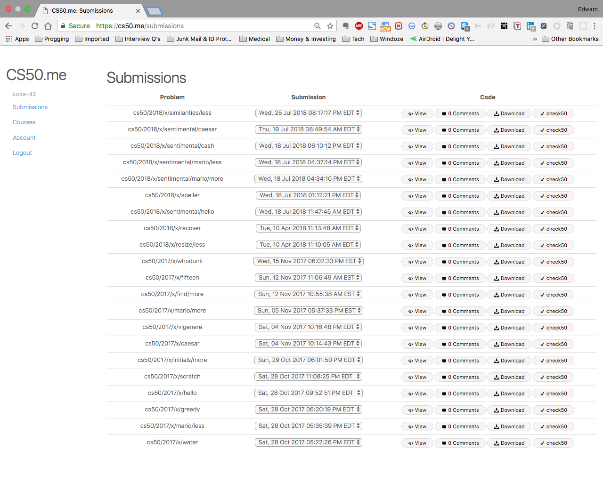

# This is CS50

This repo contains notes and solutions for the 2017 - 2018 Harvard CS50 Problem Sets 

PSet 1: https://github.com/code-42/CS50/tree/master/pset1

PSet 2: https://github.com/code-42/CS50/tree/master/pset2

PSet 3: https://github.com/code-42/CS50/tree/master/pset3

PSet 4: https://github.com/code-42/CS50/tree/master/pset4

PSet 5: https://github.com/code-42/CS50/tree/master/pset5/speller

PSet 6: https://github.com/code-42/CS50/tree/master/pset6

PSet 7: https://github.com/code-42/CS50/tree/master/pset7/finance

