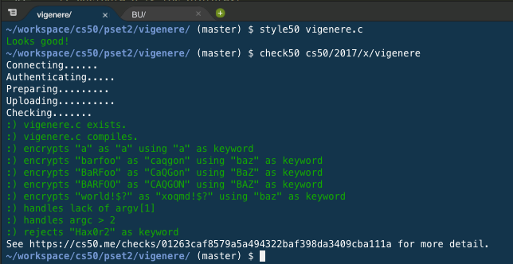

# This is cs50 - Week 2 - Vigenère



Disclaimer: unashamedly converted to README.md from https://docs.cs50.net/problems/vigenere/vigenere.html

## [tl;dr](#tl-dr)

Implement a program that encrypts messages using Vigenère's cipher, per the below.

```
$ <span class="underline">./vigenere ABC</span>
plaintext:  <span class="underline">HELLO</span>
ciphertext: HFNLP
```

## [Background](#background)

Vigenère's cipher improves upon [Caesar's cipher](../caesar/caesar.html) by encrypting messages using a sequence of keys (or, put another way, a keyword). In other words, if _p_ is some plaintext and _k_ is a keyword (i.e., an alphbetical string, whereby A represents 0, B represents 1, C represents 2, ...​, and Z represents 25), then each letter, _c<sub>i</sub>_, in the ciphertext, _c_, is computed as:
\[c_i = (p_i + k_j) \bmod 26\]

Note this cipher's use of _k<sub>j</sub>_ as opposed to just _k_. And if _k_ is shorter than _p_, then the letters in _k_ must be reused cyclically as many times as it takes to encrypt _p_.

In other words, if Vigenère himself wanted to say HELLO to someone confidentially, using a keyword of, say, ABC, he would encrypt the H with a key of 0 (i.e., A), the E with a key of 1 (i.e., B), and the first L with a key of 2 (i.e., C), at which point he'd be out of letters in the keyword, and so he'd reuse (part of) it to encrypt the second L with a key of 0 (i.e., A) again, and the O with a key of 1 (i.e., B) again. And so he'd write HELLO as HFNLP.

<caption>Table 1. Encrypting HELLO with a keyword of ABC (reused cyclically as ABCAB) yields HFNLP.</caption>

| **plaintext** | H | E | L | L | O |
| **+ key** | A | B | C | A | B |
| 0 | 1 | 2 | 0 | 1 |
| **= ciphertext** | H | F | N | L | P |

## [Specification](#specification)

Design and implement a program that encrypts messages using Vigenère's cipher.

* Implement your program in a file called `vigenere.c` in a directory called `vigenere`.
* Your program must accept a single command-line argument: a keyword, _k_, composed entirely of alphabetical characters.
* If your program is executed without any command-line arguments, with more than one command-line argument, or with one command-line argument that contains any non-alphabetical character, your program should print an error (of your choice) and exit immediately, with `main` returning `1` (thereby signifying an error).
* Otherwise, your program must proceed to prompt the user for a string of plaintext, _p_, (as by a prompt for `plaintext:`) which it must then encrypt according to Vigenère's cipher with _k_, ultimately printing the result (prepended with `ciphertext:` and ending with a newline) and exiting, with `main` returning `0`.
* With respect to the characters in _k_, you must treat `A` and `a` as 0, `B` and `b` as 1, ...​ , and `Z` and `z` as 25.
* Your program must only apply Vigenère's cipher to a character in _p_ if that character is a letter. All other characters (numbers, symbols, spaces, punctuation marks, etc.) must be outputted unchanged. Moreover, if your code is about to apply the _j<sup>th</sup>_ character of _k_ to the _i<sup>th</sup>_ character of _p_, but the latter proves to be a non-alphabetical character, you must wait to apply that _j<sup>th</sup>_ character of _k_ to the next alphabetical character in _p_; you must not yet advance to the next character in _k_.
* Your program must preserve the case of each letter in _p_.

## [Walkthrough](#walkthrough)

## [Usage](#usage)

Your program should behave per the examples below. Assumed that the underlined text is what some user has typed.

```
$ <span class="underline">./vigenere 13</span>
Usage: ./vigenere k
```

```
$ <span class="underline">./vigenere</span>
Usage: ./vigenere k
```

```
$ <span class="underline">./vigenere bacon and eggs</span>
Usage: ./vigenere k
```

```
$ <span class="underline">./vigenere bacon</span>
plaintext: <span class="underline">Meet me at the park at eleven am</span>
ciphertext: Negh zf av huf pcfx bt gzrwep oz
```

## [Testing](#testing)

To help you test `vigenere`, we've written a program called `devigenere` for you that also takes one and only one command-line argument (a keyword) but whose job is to take ciphertext as input and produce plaintext as output. To use our program, execute

```
~cs50/pset2/devigenere k
```

at your prompt, where `k` is some keyword. Presumably you'll want to paste your program's output as input to our program; be sure, of course, to use the same key. Note that you do not need to implement `devigenere` yourself, only `vigenere`.

### [`check50`](#code-check50-code)

```
check50 cs50/2017/x/vigenere
```

## [Staff's Solution](#staff-s-solution)

```
~cs50/pset2/vigenere
```

## [Hints](#hints)

Not sure where to begin? As luck would have it, this program's pretty similar to [`caesar`](../caesar/caesar.html)! Only this time, you need to decide which character in _k_ to use as you iterate from character to character in _p_.

## [FAQs](#faqs)

_None so far! Reload this page periodically to check if any arise!_

## [Changelog](#changelog)

* 2017-02-01
  - Clarified requirement of a newline at the end of the ciphered text.
* 2016-09-15
  - Clarified usage of user prompts.
* 2016-09-14
  - Added tl;dr, FAQs, Changelog.
* 2016-09-09
  - Initial release.
