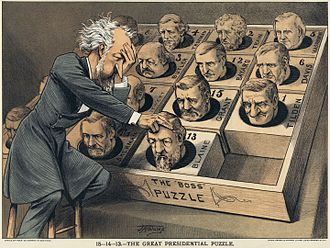
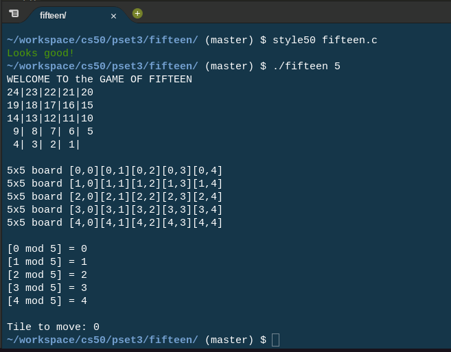
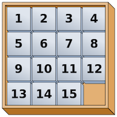
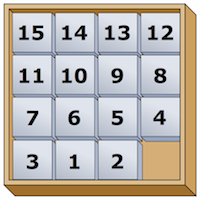

# This is CS50 - Week 3: Game of Fifteen



Props to Wikipedia article for the cartoon image here -->  https://en.wikipedia.org/wiki/15_puzzle

## [The Game of Fifteen](#The Game of Fifteen) is a puzzle played on a square, two-dimensional board with numbered tiles that slide. The goal of this puzzle is to arrange the board's tiles from smallest to largest, left to right, top to bottom, with an empty space in board's bottom-right corner, as described below.


Screenshot of Game of Fifteeen in development, showing the board, array with row and column, and mod table.


For an even groovier check50 run verification click here -->  https://cs50.me/submit50/results/code-42/4fa669fd6662edb1f2f7fa415af8468baa8b8e70

Disclaimer: shamelessly converted to README.md from https://docs.cs50.net/problems/fifteen/fifteen.html


## [tl;dr](#tl-dr)

Implement the Game of Fifteen, per the below.

```
$ ./fifteen 3
WELCOME TO GAME OF FIFTEEN

8  7  6

5  4  3

2  1  _

Tile to move:
```

## [Background](#background)

The Game of Fifteen is a puzzle played on a square, two-dimensional board with numbered tiles that slide. The goal of this puzzle is to arrange the board's tiles from smallest to largest, left to right, top to bottom, with an empty space in board's bottom-right corner, as in the below.



Sliding any tile that borders the board's empty space in that space constitutes a "move."  Although the configuration above depicts a game already won, notice how the tile numbered 12 or the tile numbered 15 could be slid into the empty space. Tiles may not be moved diagonally, though, or forcibly removed from the board.



Although other configurations are possible, we shall assume that this game begins with the board's tiles in reverse order, from largest to smallest, left to right, top to bottom, with an empty space in the board's bottom-right corner. **If, however, and only if the board contains an odd number of tiles (i.e., the height and width of the board are even), the positions of tiles numbered 1 and 2 must be swapped, as in the below.** The puzzle is solvable from this configuration.

## [Distribution](#distribution)

### [Downloading](#downloading)

```
$ wget <a href="https://github.com/cs50/problems/archive/fifteen.zip" class="bare">https://github.com/cs50/problems/archive/fifteen.zip</a>
$ unzip fifteen.zip
$ rm fifteen.zip
$ mv problems-fifteen fifteen
$ cd fifteen
$ ls
Makefile    fifteen.c   questions.txt
```

### [Understanding](#understanding)

Take a look at `fifteen.c`. Within this file is an entire framework for the Game of Fifteen. The challenge up next is to complete this game's implementation.

But first go ahead and compile the framework. (Can you figure out how?) And, even though it's not yet finished, go ahead and run the game. (Can you figure out how?) Odds are you'll want to run it in a larger terminal window than usual, which you can open clicking the green plus (+) next to one of your code tabs and clicking **New Terminal**. Alternatively, you can full-screen the terminal window toward the bottom of CS50 IDE's UI (within the UI's "console") by clicking the **Maximize** icon in the console's top-right corner.

Anyhow, it appears that the game is at least partly functional. Granted, it's not much of a game yet. But that's where you come in!

### [Checking for Understanding](#checking-for-understanding)

Read over the code and comments in `fifteen.c` and then answer the questions below in `questions.txt`, which is a (nearly empty) text file that we included for you inside of the distribution's `fifteen` directory. No worries if you're not quite sure how `fprintf` or `fflush` work; we're simply using those to automate some testing.

1. Besides 4 × 4 (which are Game of Fifteen's dimensions), what other dimensions does the framework allow?
2. With what sort of data structure is the game's board represented?
3. What function is called to greet the player at game's start?
4. What functions do you apparently need to implement?

## [Specification](#specification)

Implement the Game of Fifteen, per the comments in `fifteen.c`.

1. Implement `init`.
2. Implement `draw`.
3. Implement `move`.
4. Implement `won`.

## [Walkthrough](#walkthrough)

## [Hints](#hints)

Remember to take "baby steps." Don't try to bite off the entire game at once. Instead, implement one function at a time and be sure that it works before forging ahead. Any design decisions not explicitly prescribed herein (e.g., how much space you should leave between numbers when printing the board) are intentionally left to you. Presumably the board, when printed, should look something like the below, but we leave it to you to implement your own vision.

```
15 14 13 12

11 10  9  8

 7  6  5  4

 3  1  2  _
```

Incidentally, recall that the positions of tiles numbered 1 and 2 should only start off swapped (as they are in the 4 × 4 example above) if the board has an odd number of tiles (as does the 4 × 4 example above). If the board has an even number of tiles, those positions should not start off swapped. And so they do not in the 3 × 3 example below:

```
8  7  6

5  4  3

2  1  _
```

Feel free to tweak the appropriate argument to `usleep` to speed up animation. In fact, you're welcome to alter the aesthetics of the game. For (optional) fun with "ANSI escape sequences," including color, take a look at our implementation of `clear` and check out [http://isthe.com/chongo/tech/comp/ansi_escapes.html](http://isthe.com/chongo/tech/comp/ansi_escapes.html) for more tricks.

You're welcome to write your own functions and even change the prototypes of functions we wrote. But you may not alter the flow of logic in `main` itself so that we can automate some tests of your program once submitted. In particular, `main` must only return `0` if and when the user has actually won the game; non-zero values should be returned in any cases of error, as implied by our distribution code.

## [Testing](#testing)

To test your implementation of `fifteen`, you can certainly try playing it. (Know that you can force your program to quit by hitting ctrl-c.) Be sure that you (and we) cannot crash your program, as by providing bogus tile numbers. And know that, much like you automated input into `find`, so can you automate execution of this game. In fact, in `~cs50/pset3` are `3x3.txt` and `4x4.txt`, winning sequences of moves for a 3 × 3 board and a 4 × 4 board, respectively. To test your program with, say, the first of those inputs, execute the below.

```
./fifteen 3 < ~cs50/pset3/3x3.txt
```

### [`check50`](#code-check50-code)

Note that `check50` assumes that your board's blank space is implemented in `board` as `0`; if you've chosen some other value, best to change to `0` for `check50`'s sake. Also note that `check50` assumes that you're indexing into `board` a la `board[row][column]`, not `board[column][row]`.

```
check50 cs50/2017/x/fifteen
```

## [Staff's Solution](#staff-s-solution)

```
~cs50/pset3/fifteen
```

## [FAQs](#faqs)

_None so far! Reload this page periodically to check if any arise!_

## [Changelog](#changelog)

* 2016-09-16
  - Initial release.
