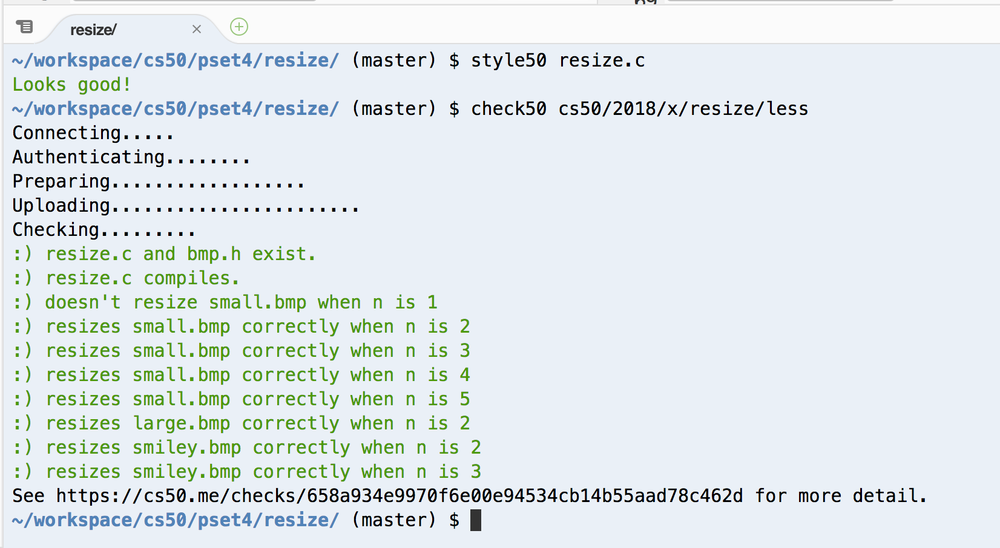
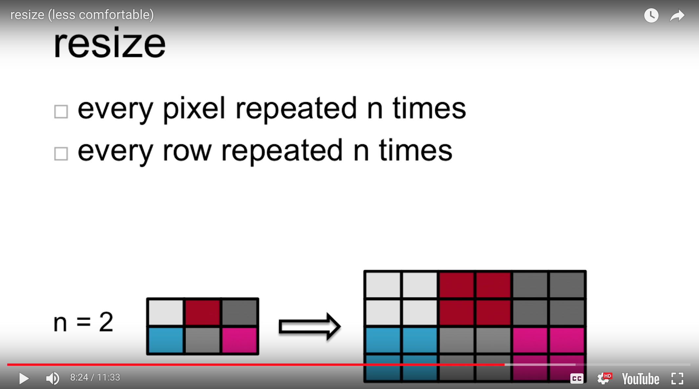

# This is CS50 - Week 4: Resize



For an even groovier check50 verification click here --> https://cs50.me/checks/658a934e9970f6e00e94534cb14b55aad78c462d

**The objective** of this exercise is to implement a program called resize that resizes (i.e., enlarges) 24-bit uncompressed BMPs by a factor of n.



Disclaimer: shamelessly converted to README.md from https://docs.cs50.net/2018/x/psets/4/resize/less/resize.html with the help of https://dillinger.io/

Table of Contents

* [tl;dr](#tl-dr)
* [Background](#background)
* [Distribution](#distribution)
  - [Downloading](#downloading)
* [Specification](#specification)
* [Walkthrough](#walkthrough)
* [Usage](#usage)
* [Hints](#hints)
* [Testing](#testing)
  - [`check50`](#code-check50-code)
* [Staff's Solution](#staff-s-solution)

# Resize

## [tl;dr](#tl-dr)

Implement a program that resizes BMPs, per the below.

```
$ ./resize 4 small.bmp large.bmp
```

## [Background](#background)

Be sure you're familiar with the structure of 24-bit uncompressed BMPs, as introduced in [Whodunit](../../whodunit/whodunit).

## [Distribution](#distribution)

### [Downloading](#downloading)

```
$ wget <a href="http://cdn.cs50.net/2017/fall/psets/4/resize.zip" class="bare">http://cdn.cs50.net/2017/fall/psets/4/resize.zip</a>
$ unzip resize.zip
$ rm resize.zip
$ cd resize
$ ls
bmp.h  copy.c  large.bmp  small.bmp  smiley.bmp
```

## [Specification](#specification)

Implement a program called `resize` that resizes (i.e., enlarges) 24-bit uncompressed BMPs by a factor of `n`.

* Implement your program in a file called `resize.c` in a directory called `resize`.
* Your program should accept exactly three command-line arguments, whereby
  - the first (`n`) must be a positive integer less than or equal to `100`,
  - the second must be the name of a BMP to be resized, and
  - the third must be the name of the resized version to be written. + If your program is not executed with such, it should remind the user of correct usage, as with `fprintf` (to `stderr`), and `main` should return `1`.
* Your program, if it uses `malloc`, must not leak any memory.

## [Walkthrough](#walkthrough)

## [Usage](#usage)

Your program should behave per the examples below. Assumed that the underlined text is what some user has typed.

```
$ <span class="underline">./resize</span>
Usage: ./resize n infile outfile
$ <span class="underline">echo $?</span>
1
```

```
$ <span class="underline">./resize 2 small.bmp larger.bmp</span>
$ <span class="underline">echo $?</span>
0
```

## [Hints](#hints)

With a program like this, we could have created `large.bmp` out of `small.bmp` by resizing the latter by a factor of 4 (i.e., by multiplying both its width and its height by 4), per the below.

```
./resize 4 small.bmp large.bmp
```

You're welcome to get started by copying (yet again) `copy.c` and naming the copy `resize.c`. But spend some time thinking about what it means to resize a BMP. (You may assume that `n` times the size of `infile` will not exceed 2<sup>32</sup> - 1.) Decide which of the fields in `BITMAPFILEHEADER` and `BITMAPINFOHEADER` you might need to modify. Consider whether or not you'll need to add or subtract padding to scanlines. And do be sure to support a value of `1` for `n`, the result of which should be an `outfile` with dimensions identical to `infile`'s.

If you happen to use `malloc`, be sure to use `free` so as not to leak memory. Try using `valgrind` to check for any leaks!

## [Testing](#testing)

If you'd like to peek at, e.g., `large.bmp`'s headers (in a more user-friendly way than `xxd` allows), you may execute the below.

```
~cs50/pset4/peek large.bmp
```

Better yet, if you'd like to compare your outfile's headers against those from the [staff's solution](#staffs-solution), you might want to execute commands like the below. (Think about what each is doing.)

```
./resize 4 small.bmp student.bmp
~cs50/pset4/resize 4 small.bmp staff.bmp
~cs50/pset4/peek student.bmp staff.bmp
```

### [`check50`](#code-check50-code)

```
check50 cs50/2018/x/resize/less
```

## [Staff's Solution](#staff-s-solution)

```
~cs50/pset4/resize
```
